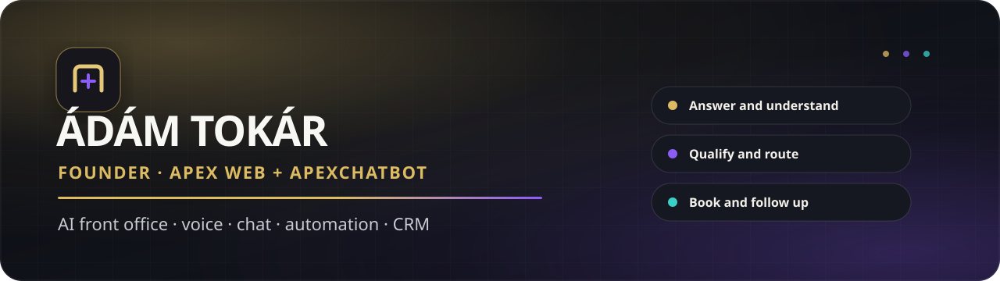

<p align="center">
  
</p>

<p align="center">
  <a href="https://apexweb.hu"></a>
  <a href="https://apexchatbot.com"></a>
  <a href="https://www.linkedin.com/company/126794058"></a>
</p>

## I build the layer between interest and revenue

I am **Ádám Tokár**, founder of **Apex Web** and **ApexChatbot**. I design AI front-office systems that can answer a call or message, understand the request, collect the right information, book or route the next step, create a clean business record, and involve a person when judgment is needed.

My work combines conversation design, software engineering, workflow automation, conversion strategy, monitoring, and founder-led delivery. The goal is not an impressive demo. The goal is a controlled system that helps a real business move an enquiry forward.

```text
call, chat, form or email
          ↓
AI front office
          ↓
answer  •  qualify  •  book  •  route  •  record
          ↓
human approval  •  CRM  •  monitoring  •  measurable follow-up
```

## Two brands, one operating thesis

<table>
  <tr>
    <td width="50%" valign="top">
      <h3><a href="https://apexweb.hu">Apex Web</a></h3>
      <p>Hungarian AI implementation partner for companies that need faster responses, fewer lost enquiries, and less repetitive administration.</p>
      <p><strong>Voice AI • website chat • booking • lead routing • business automation • conversion-focused websites</strong></p>
      <p><a href="https://apexweb.hu/appointment">Book an English meeting</a> · <a href="https://apexweb.hu/foglalas">Foglalás magyarul</a></p>
    </td>
    <td width="50%" valign="top">
      <h3><a href="https://apexchatbot.com">ApexChatbot</a></h3>
      <p>Global multilingual AI chatbot platform for website sales, customer support, qualification, and guided next steps.</p>
      <p><strong>Multilingual chat • approved product knowledge • human handoff • fit guidance • privacy boundaries</strong></p>
      <p><a href="https://apexchatbot.com">Explore the platform</a></p>
    </td>
  </tr>
</table>

## Systems I build

| Capability | What the finished system does |
|---|---|
| AI receptionist | Answers calls, understands intent, handles interruptions, checks availability, books supported slots, and transfers or records the request when a person is needed |
| AI chatbot | Answers from approved business knowledge, qualifies interest, recommends the right next step, and hands over uncertainty instead of inventing an answer |
| CRM and lead routing | Turns calls, chats, forms, and emails into structured records with source, status, owner, consent, and follow-up state |
| Business automation | Connects email, calendars, documents, invoicing, webshops, databases, and internal approval workflows |
| Ecommerce assistance | Helps visitors navigate products and policies while keeping stock, price, and regulated advice inside verified boundaries |
| Monitoring and QA | Separates real customers from synthetic tests, checks audio and tool outcomes, scores conversations, and turns failures into reviewed improvements |
| Conversion systems | Connects landing pages, booking, analytics, source attribution, and follow-up around one measurable customer journey |
| Enterprise pilots | Starts with one bounded problem, baseline, acceptance threshold, human escalation, evidence pack, and measured rollout decision |

## Selected work

### Production products

- **[Apex Web AI front office](https://apexweb.hu)**: Hungarian voice, chat, booking, lead capture, routing, administration, and operational monitoring.
- **[ApexChatbot](https://apexchatbot.com)**: multilingual website chatbot product with clear product knowledge and human approval boundaries.

### Public engineering work

- **[LangGraph Job Search Agent](https://github.com/apexweb-adam/langgraph-jobsearch-agent)**: job discovery, AI scoring with deterministic guardrails, human approval, and a daily decision digest.
- **[Apify Indeed Scraper](https://github.com/apexweb-adam/apify-indeed-scraper)**: a Crawlee and Playwright actor built for structured job-source collection.

### Selected Fiverr delivery

I built a private, client-specific remote job-search operating system with lane classification, fit scoring, resume selection, approval states, application tracking, and an interactive browser demo. Other delivery work includes multi-board discovery, document generation, operational dashboards, and bounded approval workflows. Client identity and private source material stay private by design.

## Technical toolkit

<p>
  
  
  
  
  
  
  
  
  
  
  
  
  
</p>

**Voice and conversation:** Vapi, ElevenLabs, Soniox, multilingual prompt systems, tool calling, interruption handling, post-call analysis.

**Automation and data:** Supabase, PostgreSQL, APIs, webhooks, Netlify Functions, scheduled workflows, n8n, Make, Zapier, analytics, and CRM routing.

**Delivery:** source-of-truth registries, synthetic test hygiene, fail-closed releases, monitored production checks, human approval, and evidence-driven iteration.

## How I work

1. Find the expensive operational moment.
2. Map the current process, data, permissions, and failure modes.
3. Build the smallest system that can prove value safely.
4. Test the difficult conversations and broken-tool paths, not only the happy path.
5. Measure the business outcome before expanding the scope.

I work directly with clients. For larger projects, the delivery model is a controlled pilot with named ownership, explicit acceptance criteria, and only the controls that can be demonstrated in practice.

## Beszéljünk

Magyar vállalkozásoknak az **[Apex Web](https://apexweb.hu)** oldalon mutatom be a megoldásokat. Nemzetközi chatbot projektekhez az **[ApexChatbot](https://apexchatbot.com)** a kiindulópont.

<p align="center">
  <a href="https://apexweb.hu/appointment"><strong>Book a meeting</strong></a>
  &nbsp;•&nbsp;
  <a href="mailto:info@apexweb.hu"><strong>info@apexweb.hu</strong></a>
  &nbsp;•&nbsp;
  <a href="https://www.linkedin.com/company/126794058"><strong>LinkedIn</strong></a>
</p>
